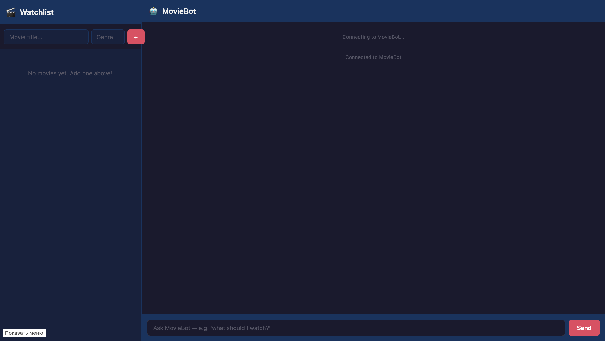
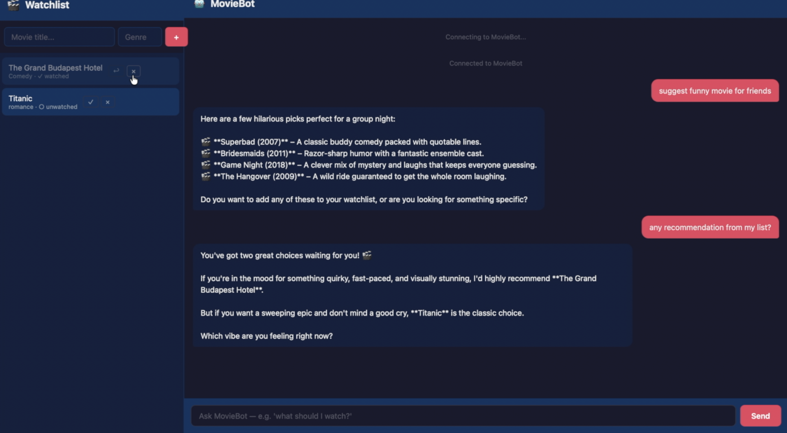

# MovieBot — Your Personal Movie Watchlist Assistant

A web app to save movies you want to watch, plus a chat-style AI assistant that helps you pick what to watch — from your own list or with fresh recommendations.

## Demo

### Main screen — watchlist + chat

The app shows your movie watchlist on the left and the MovieBot chat on the right. You can add movies, mark them as watched, delete them, and ask the bot for suggestions — all in one view.


### Chat with the assistant

Ask MovieBot questions like *"what should I watch tonight?"* or *"recommend some sci-fi mind-benders"* — it searches your watchlist or suggests new movies.




## Product context

**End users:** Casual movie fans who get recommendations from friends, trailers, or reviews and want to keep track of them in one place.

**Problem:** People save movie names in scattered places — notes apps, WhatsApp messages, bookmarks, memory. When it's time to pick something to watch, nothing is in one place, and there's nobody to help choose.

**Solution:** A single web app where you save every movie recommendation, plus an AI assistant that knows your list and can suggest what to watch based on genre, mood, or theme — or recommend something entirely new.

## Features

### Implemented

- [x] Add movies to a personal watchlist (title + optional genre)
- [x] View all movies in a clean list with watched/unwatched status
- [x] Mark movies as watched / unwatched
- [x] Delete movies from the list
- [x] Chat with MovieBot AI — asks your watchlist and suggests from it
- [x] MovieBot recommends movies outside the watchlist on request
- [x] Single-page web UI with side-by-side watchlist and chat

### Not yet implemented

- [ ] Search/filter within the watchlist UI
- [ ] User authentication — currently one shared watchlist
- [ ] Movie details from an external API (TMDB posters, ratings)
- [ ] Telegram bot interface
- [ ] Mobile app version

## Usage

1. Open the app in your browser at `http://<vm-ip>:3000`.
2. **Add movies** using the input at the top of the left panel.
3. **Manage movies** — click ✓ to mark watched, ✕ to delete.
4. **Chat with MovieBot** — type questions on the right, e.g.:
   - *"what should I watch?"*
   - *"recommend some cozy comedies"*
   - *"add The Grand Budapest Hotel to my list"*
   - *"best thrillers of the 2010s?"*

## Deployment

### Requirements

- **OS:** Ubuntu 24.04 LTS
- **Installed:** Docker and Docker Compose

### Step-by-step

**1. Install Docker**

```sh
# Install Docker
curl -fsSL https://get.docker.com | sh
sudo usermod -aG docker $USER
newgrp docker
```

**2. Clone the repo**

```sh
git clone https://github.com/poliname17/se-toolkit-hackathon.git
cd se-toolkit-hackathon
```

**3. Configure credentials**

```sh
cp .env.docker.example .env.docker.secret
nano .env.docker.secret
```

Fill in at minimum:
- `LLM_API_KEY` — your DashScope/Qwen API key
- `LLM_API_MODEL` — e.g. `coder-model` or `qwen-plus`

**4. Copy the Qwen API proxy**

```sh
# Copy qwen-code-api source from Lab 8 (if available)
cp -r ~/se-toolkit-lab-8/qwen-code-api .
```

**5. Start the stack**

```sh
docker compose --env-file .env.docker.secret up --build -d --remove-orphans
```

**6. Open the app**

Open `http://<your-vm-ip>:3000` in a browser.

### Architecture

```
[Browser — Frontend UI at :3000]
     |
     | GET /api/movies/  →  Backend API
     | WebSocket /ws     →  MovieChat Agent
     |
[Backend API (FastAPI)] ←→ [SQLite — movies.db]
     |
[MovieChat Agent] ←→ [qwen-code-api proxy] ←→ [DashScope LLM]
     |
     └── 7 tools: list, add, update, delete, search, unwatched, recommend_external
```
